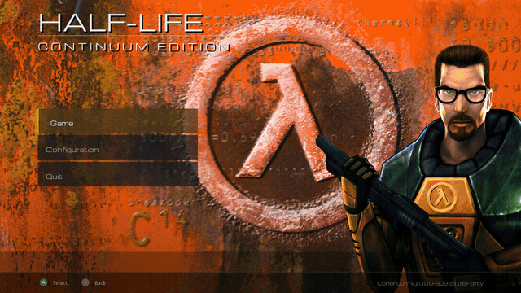

# Half-Life: Continuum Edition

A fork of the Xash3D-FWGS engine that plays Half-Life **start to finish with no
loading screens**, behind a unified controller-first menu — plus a few optional
visual and quality-of-life extras. Same game, same content, smoother ride.

> Created with assistance from Anthropic Fable 5, Opus 4.8, and Zennthic
> Elefant second-brain memory system.



## What this is — and isn't

**It is not** a mod, a remaster, or a content pack. There is no new or modified
content, story, or gameplay. You play the same Half-Life you already own.

**It is** a fork of the Xash3D-FWGS engine that adds:

- a new **unified, controller-first menu UI**, with a few existing settings
  exposed that the stock menu hid — mostly a new "theme" over the same engine;
- controller bindings by default
- a **"level streaming system"** — play the whole campaign with no loading
  screens ([details](doc/level-streaming.md));
- an optional, configurable **projected flashlight**
  ([details](doc/flashlight.md));
- supplemental **ambient occlusion**, contact and world
  ([details](doc/ambient-occlusion.md));
- reworked entity shadows (Xash3D already had experimental entity shadows, I just tweaked it)
- a few additional **quality-of-life settings**, all optional.

## Getting started

Continuum needs the original Half-Life game data — it doesn't ship any. Grab the
release build for your platform (or [build from source](doc/building.md)), then
follow the steps below. Expansions and mods install exactly like `valve` — add
their folder alongside it (Opposing Force `gearbox`, Blue Shift `bshift`, They
Hunger `hunger`, …) and select them in-game from the menu's Game page, or pass
`-game gearbox` on platforms with a command line.

### Linux

1. Extract `continuum-linux-amd64.tar.gz`.
2. Copy your retail `valve/` folder into the extracted folder, next to `xash3d.sh`.
3. Run `./xash3d.sh` (an expansion: `./xash3d.sh -game gearbox`).

### Flatpak (Steam Deck)

1. Install the bundle: `flatpak install --user ./continuum.flatpak`.
2. Add your game data to the app's data dir. If Half-Life is on the internal
   drive, symlink it (no copy):

   ```sh
   ln -sfn ~/.local/share/Steam/steamapps/common/Half-Life/valve \
     ~/.var/app/org.continuum.HalfLife/data/valve
   ```

   Expansions go next to it (`.../data/gearbox`, `.../data/bshift`, …).
3. Launch with `flatpak run org.continuum.HalfLife`, or add it to Steam as a
   non-Steam game and play from Game Mode.

From another machine you can build and install onto a Deck over SSH in one step:
`DECK_SSH=deck@steamdeck.local make install-deck`.

### Windows

1. Extract `continuum-win32.zip`.
2. Copy your retail `valve/` folder in next to `xash3d.exe`.
3. Double-click `xash3d.exe` (an expansion: add `-game gearbox` to the command line).

This is a 32-bit build, primarily validated under Wine; reports from real
Windows hardware are welcome.

### macOS

**Apple Silicon (arm64) only — Intel Macs are not supported.**

1. Unzip `continuum-macos-arm64.zip` and move `Continuum.app` to Applications
   (optional).
2. Launch it once. With no game data present it opens
   `~/Library/Application Support/Continuum/` and prompts you for your files.
3. Copy your retail `valve/` folder into that folder (expansions too — `gearbox`,
   `bshift`, `hunger`), then launch again. Switch between installed games from
   the in-game menu's Game page.

Building it yourself instead? See **[doc/building.md](doc/building.md)** —
in short, `git clone --recurse-submodules`, then `make play`.

## Compatibility

- **Games & mods:** primary support: Half-Life, Opposing Force, Blue Shift, Uplink, They Hunger, USS darkstar. However, the same expansions and mods supported by upstream Xash3D-FWGS should work
  - Use Steam version of games where available
- **Savegames:** existing Xash3D-FWGS savegames should load (not exhaustively
  tested).

## Documentation

- [The menu](doc/menu.md) — the unified controller-first UI
- [Level streaming](doc/level-streaming.md) — how the no-loading-screen
  campaign works
- [Flashlight](doc/flashlight.md) — the optional projected flashlight
- [Ambient occlusion](doc/ambient-occlusion.md) — contact + world AO
- [Console variable reference](doc/cvars.md) — every cvar and command Continuum
  adds
- [Building from source](doc/building.md)

This project documents only what it *adds* to the engine — for the engine
itself, see the upstream Xash3D-FWGS documentation.

## Repositories

Continuum is an umbrella project over three engine/SDK forks:

- Umbrella: <https://github.com/bishopdynamics/Continuum>
- Engine fork (Xash3D-FWGS): <https://github.com/bishopdynamics/xash3d-fwgs>
- Menu fork (mainui_cpp): <https://github.com/bishopdynamics/mainui_cpp>
- Game SDK fork (hlsdk-portable): <https://github.com/bishopdynamics/hlsdk-portable>
